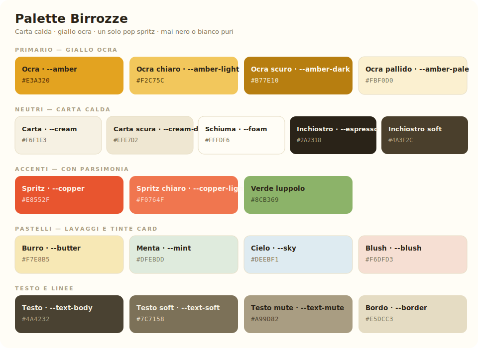

# Birrozze — Identity

> L'identità visiva di Birozze: il taccuino goliardico della vacanza studio.
> Calda come la carta di un birrificio artigianale, colorata come un widget iOS,
> illustrata come un'etichetta di birra.

---

## 1. La Palette



*(Se l'immagine non si vede, apri `palette.svg` — gli swatch sono lì. Tabelle con gli hex qui sotto.)*

### Primario — Giallo Ocra

| Token CSS | Hex | Ruolo |
|---|---|---|
| `--amber` | `#E3A320` | Colore firma: tile Consumazioni, CTA, pill attive, accenti |
| `--amber-light` | `#F2C75C` | Titoli oro su fondi inchiostro, gradienti delle incisioni |
| `--amber-dark` | `#B77E10` | Anelli e contorni delle etichette, testo ocra su chiaro |
| `--amber-pale` | `#FBF0D0` | Fondi tinta, chip, ticker |

### Neutri — Carta calda

| Token CSS | Hex | Ruolo |
|---|---|---|
| `--cream` | `#F6F1E3` | Sfondo pagina (mai bianco puro) |
| `--cream-deep` | `#EFE7D2` | Bande e superfici secondarie |
| `--foam` | `#FFFDF6` | Superficie delle card bianche |
| `--espresso` | `#2A2318` | Inchiostro: testo e tile scure (mai nero puro) |
| `--espresso-soft` | `#4A3F2C` | Inchiostro attenuato |

### Accenti — con parsimonia

| Token CSS | Hex | Ruolo |
|---|---|---|
| `--copper` | `#E8552F` | **Spritz**: UN solo elemento per vista (timer, percorsi, segnali) |
| `--copper-light` | `#F0764F` | Hover dello spritz |
| *(verde luppolo)* | `#8CB369` | Tile Spese: il colore dei soldi, caldo e in famiglia con l'ocra |

### Pastelli — lavaggi e tinte

| Token CSS | Hex | Ruolo |
|---|---|---|
| `--butter` | `#F7E8B5` | Lavaggio caldo dei pannelli illustrati |
| `--mint` | `#DFEBDD` | Lavaggio verde tenue |
| `--sky` | `#DEEBF1` | Lavaggio freddo |
| `--blush` | `#F6DFD3` | Lavaggio pesca |

### Testo e linee

| Token CSS | Hex | Ruolo |
|---|---|---|
| `--text-body` | `#4A4232` | Testo corrente |
| `--text-soft` | `#7C7158` | Testo secondario |
| `--text-mute` | `#A99D82` | Label, didascalie |
| `--border` | `#E5DCC3` | Bordi e divisori (tratteggiati dove serve calore) |

**Proporzioni** (regola 60/25/10/5): carta calda ~60%, ocra e oro ~25%,
inchiostro + pastelli ~10%, spritz ~5%. Se lo spritz supera il 5%, smette di essere un pop.

---

## 2. I Font

Caricati via Google Fonts in `shared.css`:

```css
@import url('https://fonts.googleapis.com/css2?family=Bricolage+Grotesque:wght@400..800&family=Instrument+Sans:ital,wght@0,400..700;1,400&family=Caveat:wght@500..700&family=JetBrains+Mono:wght@400;600&display=swap');
```

| Font | Token | Ruolo | Come usarlo |
|---|---|---|---|
| **Bricolage Grotesque** | `--font-display` | Titoli, numeroni, nomi delle tile | Peso 700–800, letter-spacing negativo (−0.02/−0.035em). È la voce del brand: grottesco con carattere, mai corporate. |
| **Instrument Sans** | `--font-body` | Testo corrente, UI, bottoni | Peso 400–700. Leggibile e amichevole, non ruba mai la scena. |
| **Caveat** | `--font-hand` | Perle, annotazioni, chiuse dei titoli ("*in un colpo d'occhio.*"), stati del timer | Peso 500–600, corsivo, sempre più grande del testo intorno (1.1–1.5×): la scrittura a mano è un gesto, non una nota a piè di pagina. |
| **JetBrains Mono** | `--font-mono` | Cifre del timer, contatori, prezzi | `tabular-nums` per l'allineamento delle colonne. |
| Georgia (serif di sistema) | — | **Solo dentro le illustrazioni-etichetta**: i motti incisi sui nastri ("GRAN RISERVA") e la scritta BIROZZE sulla bottiglia | Maiuscolo, letter-spacing 2–4. È l'unica concessione al serif, come su una vera etichetta. |

**Scala tipografica indicativa:** hero `clamp(42px, 9vw, 96px)` · titolo sezione
`clamp(28px, 4.6vw, 44px)` · titolo tile 19–23px · label 10.5px maiuscolo
spaziato · corpo 15px.

---

## 3. Stile delle illustrazioni — "Etichetta di birra"

Ogni pannello illustrato delle tile segue la stessa grammatica, presa dalle
etichette dei birrifici e ammorbidita dai lavaggi pastello:

1. **Medaglione centrale**: cerchio `--foam`/`--amber-pale` con anello spesso
   `#B77E10` (3.5px) + anello interno tratteggiato `#E3A320` (`dasharray 4 5`),
   come un timbro.
2. **Soggetto inciso** nel medaglione: boccale, coppa, macchina fotografica,
   moneta €, statuetta, bussola — riempimento a gradiente oro
   (`#F2C75C → #B77E10`) con contorno scuro `#7C5106`, stile incisione.
3. **Nastro con motto** sotto il medaglione: rettangolo ocra con code piegate
   `#B77E10` e motto in Georgia maiuscolo spaziato. Motti attuali:
   *GRAN RISERVA · N°1 SPUGNA · RICORDI DOC · CONTI PARI · GRAN PREMIO · NUOVA TAPPA*.
4. **Lavaggio di fondo sfumato** (rif. app educational): gradiente morbido a 150°
   di un pastello della palette (`ill-blush`, `ill-butter`, `ill-sky`, `ill-mint`,
   `ill-dark` per le tile inchiostro).
5. **Coriandoli sparsi**: stelline a 4 punte (ocra e spritz), puntini e trattini
   ondulati a bassa opacità, posizionati in modo asimmetrico negli angoli.
6. **Dettagli da etichetta**: spighe/foglie di luppolo ai lati, piccoli elementi
   che sbucano da dietro il medaglione (una polaroid, un percorso tratteggiato).

**Regola d'oro:** niente foto stock, niente icone "da libreria", niente stile
3D iperrealista. Tutto è SVG disegnato a mano, caldo e leggermente imperfetto.

---

## 4. Forma e spazio (quick specs)

- **Tile**: raggio 28px continuo, niente bordi, ombra `0 10px 26px rgba(42,35,24,.07)`, gap costante 14px (sistema iOS).
- **Bottoni e chip**: sempre a pillola (`border-radius: 999px`).
- **Pannelli illustrati**: raggio 18px dentro le tile.
- **Sezioni**: testata allineata a sinistra con azione a destra ("Vedi tutto →"), respiro verticale `--space-xxl` (fino a 140px desktop).
- **Hover**: lift −4px sobrio; `:active` scala 0.985 (feedback da tap).
- **Motion**: 150–250ms, rispetto di `prefers-reduced-motion`.

---

## 5. Anti-pattern

- ❌ Nero `#000` o bianco `#FFF` puri — usare `--espresso` e `--foam`.
- ❌ Più di un elemento spritz per vista.
- ❌ Colori fuori palette quando esiste un token.
- ❌ Font aggiuntivi oltre ai cinque della sezione 2.
- ❌ Emoji come icone; icone solo SVG a tratto o incisioni oro.
- ❌ Ombre dure o bordi freddi grigi.
- ❌ Appiattire la gerarchia: ogni tile ha UN numero o UN soggetto protagonista.

---

*Birrozze v7 — identity aggiornata al 17/07/2026. La palette vive in `shared.css` (token CSS), questo documento è la sua fotografia.*
